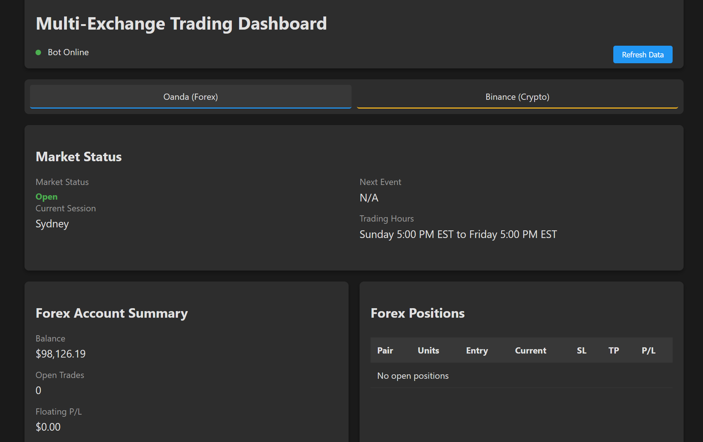

# Strategy Server

**A lightweight, server-side solution for deploying and managing automated trading strategies.**

## About the Project

The Strategy Server is designed to streamline the deployment of trading strategies in a centralized and efficient manner. By connecting seamlessly with trading platforms and leveraging robust server-side technology, it enables traders to focus on refining their strategies without worrying about infrastructure or performance bottlenecks.

This project is ideal for traders looking to automate their strategies, manage multiple strategies across different assets, or integrate with platforms like MetaTrader, Oanda, or TradingView.

---

## Features

- **Lightweight Architecture**: Minimal resource usage to run smoothly even on low-spec servers.
- **API Integrations**: Currently supports [list the platforms, e.g., Oanda], with plans for more.
- **Scalable Design**: Manage multiple strategies across different assets and timeframes.
- **Customization**: Easy-to-modify codebase for tailored functionality.
- **Ease of Use**: Intuitive setup and deployment.

---

## Getting Started

### Prerequisites

To get started with Strategy Server, you need:

- **Python 3.10+** installed on your machine.
- A virtual environment tool (e.g., `venv` or `conda`).

### Installation

1. Clone the repository:

   ```bash
   git clone https://github.com/kurtisbu/Strategy-Server.git
   cd Strategy-Server
   ```

2. Set up the environment:

   ```bash
   python -m venv venv
   source venv/bin/activate # For MacOS/Linux
   venv\Scripts\activate    # For Windows
   ```

3. Install the dependencies:

   ```bash
   pip install -r requirements.txt
   ```

4. Configure your environment variables by creating a `.env` file:

   ```plaintext
   API_KEY=<your-api-key>
   DB_CONNECTION_STRING=<your-database-connection-string>
   ```

5. Start the server:

   ```bash
   python app.py
   ```

---

## Usage

The Strategy Server acts as a bridge between your trading strategies and broker accounts, enabling seamless execution of trades via webhook commands.

1. **Trade Execution**: Receives webhook commands and executes trades with supported brokers (e.g., Oanda or Binance).
2. **Dynamic Management**: Manages trading strategies across multiple assets and timeframes.
3. **Integration**: Easily integrates with your trading platform for automated trade execution.

---


## Dashboard

The dashboard tracks the current market status and any active trades for either broker that is connected, as well as the Account Summary.


---

## Contributing

Contributions are welcome! If you'd like to improve the project, feel free to fork the repository and submit a pull request.

1. Fork the Project.
2. Create your Feature Branch (`git checkout -b feature/AmazingFeature`).
3. Commit your Changes (`git commit -m 'Add some AmazingFeature'`).
4. Push to the Branch (`git push origin feature/AmazingFeature`).
5. Open a Pull Request.

---

## Roadmap

- **Dynamic Position Sizing**: Implement adaptive position sizing to enhance strategy flexibility.
- **Additional Broker Support**: Expand to support more brokers, including [e.g., Binance, others].
- **Enhanced Dashboard**: Develop a robust dashboard for trade visualization and monitoring.
- Add support for additional trading platforms.
- Build out advanced performance monitoring dashboards.
- Enhance API with more robust error handling and logging.

---

## License

Distributed under the MIT License. See `LICENSE` for more information.

---

## Contact

**Kurtis Bulock**  
GitHub: [@kurtisbu](https://github.com/kurtisbu)  
Email: [your-email@example.com]
